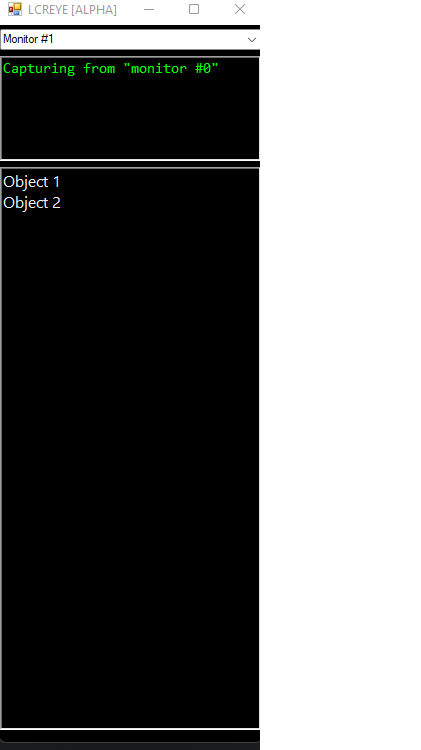
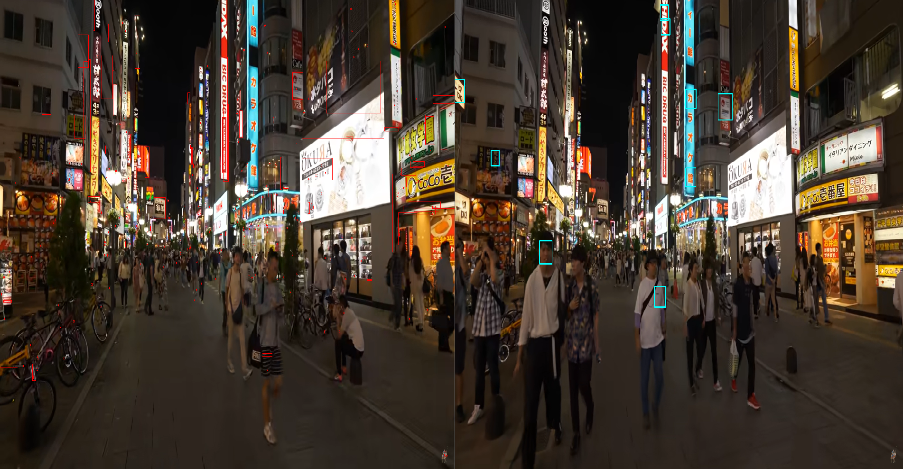
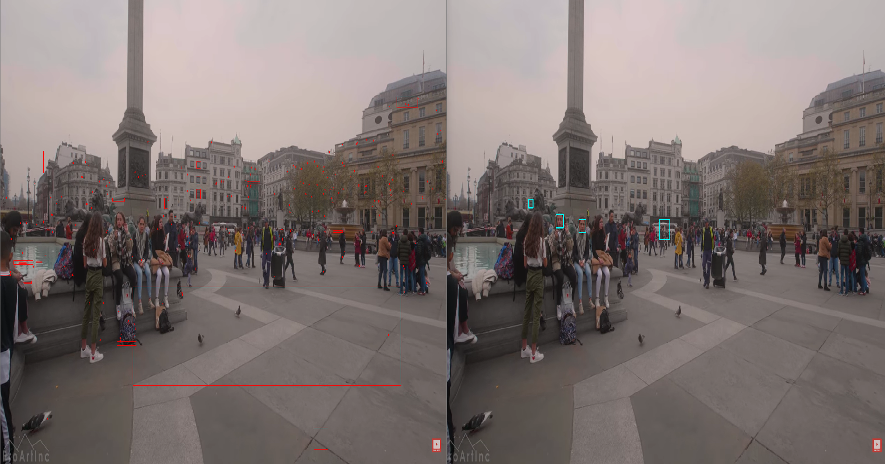

# LCREYE
Live sCreen Record Eye

# LCREYE (Live sCreen Record Eye)

## Usage
Automatted face and object tagging for video and desktop recording

## Tool Description
Automation of object detection and facial detection focused on desktop recording or video recording. With this, researchers using videos can get a list of objects and/or faces with their time signature and image data. They can then export found data points into a picture folder and/or json list with image and coordinates. We look to open up analysis of images and make it easier to run opencv and other recognition tools.  

At its current stage, the tool is using OpenCV for facial detection and for shape detection up to 8 sides. There is more refining needing to be done. It is also Windows only.

We hope to expand adding in machine learning for better object detection and facial recognition along with tagging information. We hope to also open up the ability to add your own tensorflow models and build in plugins using C++.

For the non-technical researcher, we hope to cut through the task of labeling or watching for details with a strained eye and missing the whole picture.
 
## Installation
[OpenCV 4.6.0 for Windows](https://sourceforge.net/projects/opencvlibrary/files/4.6.0/) must be install on the C drive (at C:\opencv)

~~Run the install MSI~~ Install file still in the works

If wanting to run, please clone the project with Visual Studio 2022 and follow these install instructions on adding opencv to Visual Studio 2022 [Setup OpenCV in Visual Studio 2022 for C/C++ Development](https://www.youtube.com/watch?v=unSce_GPwto)

# Updates/Log

## 09/26/2022

This began as a project for the Bellingcat hackathon call for the creation of OSINT tools to help researchers

[Build Digital Investigation Tools in Bellingcat’s September Hackathons](https://www.bellingcat.com/september-hackathon-announcement-aug-2022/)

With the competition now complete, I will be continuing work on the project when the schedule fits. Currently, working on:

- [MAJOR BUG/ISSUE] **Fix using the actual resolution of the selected monitor**
	- Right now it is just using the primary monitor resolution and trying to use GDI was not giving me the information needed. Using HMONITORINFO and other methods online did not give the proper RECT coordinates or had nothing at all coming from the monitor ENUM. Will need to work on this further and get it fixed ASAP. Might need to dig into other APIs for help on getting the resolution.

- Add back the drop down for selection capture by app 
	- Combine Monitor selection with app as in select apps from a monitor
	- Remove background unseen apps that cannot be or will not be captured

- Creation of a configuration manager to easily turn off detectors
	- Would like add an interface to load opencv models

- Add in TensorFlow spatial word model through OpenCV for word detection

- Implement word/letter/lexicon detection using OpenCV and TesseractOCR

- Implement face detection with OpenCV [Works]
	- Right now just front face detection but would like to add side face and other angels

- Implement shape detection with OpenCV [Works but badly]
	- Currently we (almost) have rectangles but would like to add in circles, squares, polygons, etc

- Add in objects found to object list and allow user to remove objects
	- This is after we implement and fix/refine the detectors

- Add in found bounding area/box editor	
	- WIll work like in illustrator or GIMP where you can edit the area/box points/verticies

# Alpha [Broken Badly] Screenshots

## Tokyo @ Night test
**Left** Rectangle Detection **Right** Face Detection

## London @ Day test
**Left** Rectangle Detection **Right** Face Detection
